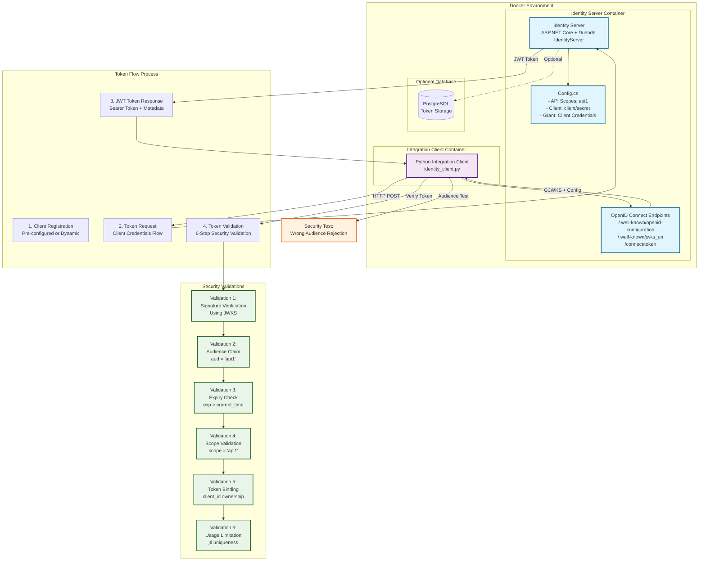

# My Identity Server

## Purpose

This project shows how to protect a JWT token against token abuse using OAuth 2.0 and OpenID Connect. The project launches an identity server, creates a script to perform a successful expected validation, and shows an attempt to abuse the token showing how its protected.

## Architecture Overview



## How It Works

This project demonstrates a complete OAuth 2.0 Client Credentials flow with comprehensive JWT token security validation:

1. **Identity Server Setup**: ASP.NET Core application using Duende IdentityServer with in-memory configuration
2. **Client Registration**: Pre-configured client (`client`/`secret`) with `api1` scope access
3. **Token Acquisition**: Client requests JWT tokens using OAuth 2.0 Client Credentials flow
4. **Token Validation**: 6-step security validation process ensures token integrity and prevents abuse
5. **Security Testing**: Validates that tokens with incorrect audiences are properly rejected

## How to Validate the Implementation

To run the complete integration test suite, use the following command:

```bash
make integration
```

### What `make integration` does:

The integration test process:
- Starts the identity server on port 5050
- Waits for the server to be healthy (checks the OpenID configuration endpoint)
- Runs the Python integration client to validate the server functionality
- Automatically shuts down and cleans up when tests complete

## What the Integration Tests Validate

The integration tests (`identity_client.py`) perform comprehensive validation of the OAuth 2.0/OpenID Connect implementation:

### 1. **Client Registration**
- Tests both dynamic client registration and pre-configured client usage
- Validates client credentials and scope assignments

### 2. **Token Acquisition (Client Credentials Flow)**
- Requests JWT access tokens using client credentials
- Validates proper token response format and metadata
- Confirms token type, expiration, and scope information

### 3. **Comprehensive JWT Token Validation**
The client performs 6 critical security validations on each JWT token:

#### **Validation 1: Token Signature Verification**
- Retrieves the server's JWKS (JSON Web Key Set) from `/.well-known/jwks_uri`
- Validates the token signature using the appropriate public key
- Ensures tokens haven't been tampered with

#### **Validation 2: Audience (aud) Claim Validation**
- Verifies the token is intended for the correct audience (`api1`)
- Prevents token misuse across different services
- Supports both single audience and audience arrays

#### **Validation 3: Expiry (exp) Claim Validation**
- Checks that tokens are not expired
- Compares token expiration time against current system time
- Prevents replay attacks with old tokens

#### **Validation 4: Scope Validation**
- Confirms the token contains the required scope (`api1`)
- Validates that the client has permission for the requested resources
- Supports both string and array scope formats

#### **Validation 5: Token Binding Validation (Proof of Ownership)**
- Verifies the token's `client_id` or `sub` claim matches the requesting client
- Ensures tokens can only be used by the client they were issued to
- Prevents token theft and misuse

#### **Validation 6: Token Usage Limitation (jti Claim)**
- Validates the JWT ID (`jti`) for one-time use scenarios
- Simulates checking against a token blacklist/database
- Helps prevent token replay attacks

### 4. **Security Testing**
- **Audience Validation Test**: Specifically tests that tokens with incorrect audiences are properly rejected
- **Error Handling**: Validates proper error responses for invalid requests
- **OpenID Discovery**: Tests the `/.well-known/openid-configuration` endpoint

### 5. **Integration Health Checks**
- Validates server startup and readiness
- Tests OpenID Connect discovery document availability
- Confirms all required endpoints are accessible

## Expected Test Output

When running `make integration`, you should see output similar to:

```
=== CLIENT REGISTRATION ===
[INFO] Using predefined client: my_client
[SUCCESS] Using pre-configured client: client

=== TOKEN ACQUISITION ===
[SUCCESS] Obtained JWT token
Token type: Bearer
Expires in: 3600 seconds

=== TOKEN VERIFICATION ===
[TOKEN INFO]
Issuer: http://identity-server:5000
Subject: client
Audience: api1
Scopes: api1
...

[VALIDATION 1] Token signature validation
[SUCCESS] Found matching public key with kid: ...
[VALIDATION 2] Audience (aud) claim validation
[SUCCESS] Token audience 'api1' matches expected audience
[VALIDATION 3] Expiry (exp) claim validation
[SUCCESS] Token is not expired
[VALIDATION 4] Scope validation
[SUCCESS] Token has required scope: api1
[VALIDATION 5] Token binding validation
[SUCCESS] Token ownership verified for client: client
[VALIDATION 6] Token usage limitation validation
[SUCCESS] Token has unique JWT ID: ...

[SUMMARY] JWT Token Validation Results:
✓ 1. Token signature validation
✓ 2. Audience claim validation
✓ 3. Expiry claim validation
✓ 4. Scope validation
✓ 5. Token binding validation
✓ 6. Token usage limitation validation

[SUCCESS] All token validations passed

=== AUDIENCE VALIDATION TEST ===
[SUCCESS] Token was correctly rejected due to invalid audience
[SUCCESS] Audience validation test passed
```

## Development Commands

Additional Makefile commands for development:

- `make build` - Build the Docker images
- `make start` - Start the development environment
- `make stop` - Stop the development environment
- `make logs` - View container logs
- `make clean` - Clean up containers and volumes

## Security Features Validated

This integration test suite ensures the identity server properly implements:

- **OAuth 2.0 Client Credentials Flow**
- **JWT Token Security** (signature, expiration, audience, scope validation)
- **OpenID Connect Discovery**
- **Proper Error Handling** for security violations
- **Token Binding** and ownership verification
- **Audience Isolation** between different APIs/services

The comprehensive validation ensures the identity server meets production security standards for token-based authentication and authorization.
